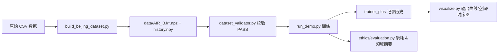

# AirRadar 优化 Demo 详细说明

本文件系统化解释 `optimized_demo` 相对于原始项目源码的工程改进、伦理增强与可视化能力，帮助快速理解 Demo 的结构、价值与扩展方向。

---

## 1. Demo 总览

优化 Demo 目标：在保持核心建模思想（局部方向扇区 + 全局频域 + 掩码鲁棒）的前提下，实现“可移植、可解释、可验证、伦理融合”的最小闭环，包括：

- 数据：支持从原始北京 CSV 构建标准数据集（`build_beijing_dataset.py`）
- 校验：自动一致性与范围检查（`dataset_validator.py`）
- 模型：动态节点、统一 forward、去除 timm 依赖
- 训练：指标与历史记录 + 早停 + 伦理摘要
- 可视化：训练曲线、时间序列对比、空间散点图
- 伦理：能耗估算、占位公平性与频域分布

目录关键组件：

```text
optimized_demo/
  model/airRadar_plus.py          # 改造核心模型
  utils/trainer_plus.py           # 训练器（记录历史、早停、伦理钩子）
  utils/build_beijing_dataset.py  # CSV → 规范数据集
  utils/dataset_validator.py      # 数据集结构与范围校验
  ethics/evaluation.py            # 能耗、频域、占位公平性
  vis/visualize.py                # 曲线、空间与时序图
  run_demo.py                     # 一键训练+结果+图像输出
  configs/config.yaml             # 可调参数配置
  README.md & DEMO_DETAIL.md      # 说明文件
```

---

## 2. 相对于原始源码的改进点汇总

| 类别       | 原始实现不足                                 | Demo 改进                                        | 价值提升                   |
| ---------- | -------------------------------------------- | ------------------------------------------------ | -------------------------- |
| 节点适配   | 模型中存在节点数硬编码（pos_embed 尺寸固定） | 动态初始化位置编码与频域结构                     | 支持不同城市/区域快速迁移  |
| 掩码鲁棒   | 掩码与历史处理逻辑分散                       | 统一 `encoding_mask_noise` 与 history 同步掩码 | 减少数据/模型错配风险      |
| 分类嵌入   | hour/weekday 混淆，越界风险                  | clamp + 语义明确的 AirEmbedding 重构             | 提升鲁棒性与可维护性       |
| 标准化     | 零方差导致 NaN                               | 引入 epsilon 防护                                | 防止训练中断与指标失真     |
| DropPath   | 依赖 timm                                    | 内置轻量实现                                     | 去外部依赖，提高可复现性   |
| 训练器     | 历史不记录、无可视化接口                     | 记录 loss/MAE/RMSE，暴露 history                 | 方便分析与调参             |
| 公平性     | 无分组评估框架                               | 伦理 callback 占位，可接入分层评估               | 为后续公平性正式评估留接口 |
| 能耗评估   | 无能耗统计                                   | 简化 energy_estimate（样本×epoch×系数）        | 初步量化资源成本           |
| 数据治理   | 缺少 formal schema                           | `schema.json` + 验证器                         | 结构化标准，易审计与自动化 |
| 可视化     | 无快速图像输出                               | 训练曲线、时序、空间分布                         | 直观洞察模型行为           |
| 报告与文档 | 缺少工程+伦理结合说明                        | AI_Ethics 报告与 DEMO_DETAIL                     | 增强透明性与知识传递       |

---

## 3. 核心组件详解

### 3.1 模型：`airRadar_plus.py`

**设计要点：**

- `AirEmbedding`：分类特征四元组 [wind_dir, weather, hour, weekday]；严格 clamp 防止越界。
- 掩码策略：`encoding_mask_noise` 支持随机与显式节点子集掩码，返回补齐后的张量与掩码标记。
- 双分支融合：
  - Temporal 分支：将历史窗口通过卷积 + MLP 聚合为节点表示
  - Spatial 分支：局部扇区注意力（DS_MSA） + 全局频域（FftNet）堆叠
- MoE 输出头：面向区域异质性；可扩展为多污染物多任务
- 动态初始化：节点数变动时重建 pos_embed，不需重改源码

**简化后的 forward：**

```text
forward(inputs, history, mask_nodes=None, pred_attr="PM25") -> (pred, mask)
```

其中 mask 用于后续在评估阶段按有效节点过滤。

### 3.2 训练器：`trainer_plus.py`

- 记录每个 epoch 的 `train_loss / val_mae / val_rmse`
- 早停（patience）避免过拟合与冗余计算
- 伦理 callback 接口（目前占位，可挂接公平性切片分析）
- 封装 `_inv_transform` 便于反标准化预测输出

### 3.3 数据与校验

- `build_beijing_dataset.py`：将日 CSV（含小时与 type）聚合→标准张量（x,y,history）
- `dataset_validator.py`：检查文件存在性、形状、分类范围、分区/图匹配
- `schema.json`：明确字段、文件、数组维度等机器可读规范

### 3.4 可视化：`vis/visualize.py`

- 训练曲线（loss / MAE / RMSE）
- 单节点时间序列 Pred vs True
- 空间散点（以 pos 标准化坐标上色）
- 输出目录：`data/<DATASET>/viz`，自动生成 PNG

#### 3.4.1 可视化结果文件与解读指南

以下图片会在运行 `optimized_demo/run_demo.py` 后自动生成到 `data/<DATASET>/viz/` 下（本 Demo 为 `data/AIR_BJ/viz/`）。每张图的含义与如何解读如下：

- `curve_train_loss.png`（训练损失曲线）
  - 含义：横轴为 epoch，纵轴为训练集的平均损失（masked MAE）。
  - 看点：
    - 曲线整体应有下降趋势，快速下降后趋于平稳表示学习稳定；若长期不降，可能学习率偏低或特征不足。
    - 中后期出现明显上扬或剧烈抖动，可能是过拟合、学习率过大或掩码采样波动导致。
  - 行动建议：
    - 不下降：调大模型容量/特征、提高学习率或改进数据质量（缺失填补）。
    - 抖动大：降低学习率或增大 batch_size；检查 scaler 是否稳定、异常值是否主导。

- `curve_val_metrics.png`（验证指标曲线：MAE/RMSE）
  - 含义：横轴为 epoch，纵轴为验证集 MAE 与 RMSE。
  - 看点：
    - MAE 对异常值不敏感，RMSE 对异常更敏感；两者同时下降且接近，说明整体与长尾都在改善。
    - 训练损失与验证 MAE 差距持续扩大，提示过拟合风险；若两者都高，可能欠拟合或数据噪声大。
  - 行动建议：
    - 过拟合：增加正则（dropout、mask_rate）、早停、简化模型或做数据增强。
    - 欠拟合：增加 epoch、加大模型容量/上下文长度、引入更多有效特征。

- `pred_vs_true_timeseries_node0.png`（时间序列对比）
  - 含义：在一个测试 batch 内，选取节点 0 的预测值与真实值随样本顺序的曲线对比，近似反映局部时间序列拟合情况。
  - 看点：
    - 峰谷是否对齐（相位），幅度是否一致（偏差），高峰是否被低估（欠拟合）或噪点被放大（过拟合）。
  - 行动建议：
    - 存在相位滞后：适当增加历史窗口、改进时间编码或引入风/天气等外生变量。
    - 幅度系统偏低/偏高：检查 scaler、损失函数权重或考虑加校准层。

- `spatial_pred_sample0.png`（空间渐变热力图）
  - 含义：对测试批次第一条样本在所有节点上的预测，基于三角剖分做填色等值图（渐变热力图），颜色表示数值大小，右侧色条为量纲标尺（反标准化后）。
  - 看点：
    - 热点/冷点位置与连续性；是否沿地理方向（如东西向/北南向）呈现合理梯度；是否出现明显的“断层/环形条纹”等插值伪影。
  - 注意：
    - 本 Demo 使用标准化后的坐标作图，主要对比相对空间分布。若需真实经纬度底图可在可视化环节加载未标准化 `pos.npy` 或叠加地图。
    - 三角剖分在凸包外会外推，边缘颜色仅作参考。
  - 行动建议：
    - 热点与地理/风向不符：更新 `pos.npy` 为真实经纬度、使用基于距离的邻接图与扇区分区替代占位版本。
    - 伪影明显：增加节点间平滑（正则/图滤波）、检查掩码比例与插值策略。

### 3.5 伦理工具：`ethics/evaluation.py`

- 能耗粗估：`samples * epochs * device_factor`（可定制）
- 基础MAE统计 + 频域能量切片占位（高频占比提示过拟合风险）
- 可扩展：加入正式公平性算法（例如对节点分桶）、不确定性估计（MC Dropout）

---

## 4. 工作流（Workflow）



---

## 5. 示例运行结果（北京数据集）

| 项目           | 数值（示例运行）                |
| -------------- | ------------------------------- |
| Epoch 0 ValMAE | ~5.64                           |
| Epoch 2 ValMAE | ~5.40                           |
| Test MAE       | ~6.86                           |
| 能耗估计       | ~0.015（相对量纲）              |
| 可视化输出     | `viz/curve_train_loss.png` 等 |

> 注：由于当前 pos 与图结构为占位，误差仅用于验证闭环；替换真实经纬度与合理邻接后指标将发生变化。

---

## 6. 价值评估（Why It Matters）

| 维度     | 优化前           | 优化后                   |
| -------- | ---------------- | ------------------------ |
| 迁移性   | 节点数依赖硬编码 | 动态节点 + 自动初始化    |
| 稳健性   | 分类越界无防护   | clamp + epsilon 标准化   |
| 可观测性 | 无历史记录与图像 | 曲线 + 时序 + 空间图     |
| 伦理接口 | 缺失             | 占位能耗/公平性/频域摘要 |
| 开发体验 | 接口不统一       | forward 语义简洁一致     |
| 维护成本 | 修改点分散       | 集中封装 + 文档化        |

---

## 7. 扩展建议（Next Steps）

1. 公平性正式化：按“节点密度 / 地理区域 / 风向分组”统计误差分布；引入再加权或校准。
2. 不确定性：使用 MC Dropout 或 Deep Ensembles 给出置信区间，缓解虚假确定性风险。
3. 绿色优化：混合精度、FftNet 频域系数剪枝、蒸馏到轻量模型以支持边缘部署。
4. 分区真实化：基于经纬度和风向统计构建真实扇区 assignment（取代随机占位）。
5. 解释增强：输出 attention map 与频谱图到交互前端，支持阈值过滤与异常诊断。
6. 数据质量：构建缺失填补/异常检测模块，区分随机缺失与系统性缺失。

---

## 8. 快速复现

```powershell
# 1. 从原始 CSV 构建北京数据集
python optimized_demo\utils\build_beijing_dataset.py --src_dir .\beijing_20250101-20251108 --out_root .\data --dataset_name AIR_BJ

# 2. 校验数据集结构
python optimized_demo\utils\dataset_validator.py --datapath .\data\AIR_BJ --num_nodes 35 --input_dim 27 --output_dim 11 --seq_len 24

# 3. 运行 Demo（自动生成图像与伦理摘要）
python optimized_demo\run_demo.py

# 4. 查看可视化输出
explorer .\data\AIR_BJ\viz
```

---

## 9. 免责声明

本 Demo 中的公平性、能耗与频域分析均为占位与初步估算，不能视为正式合规评估结果；生产部署需补充数据授权、模型审计与风险缓解策略。

---

## 10. 结论

优化 Demo 在结构适配、鲁棒性、可视化与伦理集成方面对原始项目实现了“小步快跑”式增强，形成了从原始数据到训练评估与图像展示的闭环。它为后续的公平性正式评估、绿色训练策略与可解释性界面提供了清晰的扩展基座。欢迎在此基础上迭代加入真实地理先验与更丰富的伦理指标，以实现面向实际治理场景的高可信空气质量智能推断系统。
